#AWS Cloud Practitioner

> Pay as you go pricing

###Deployment models of cloud
<ul>
<li><strong>Private Cloud: </strong>

</li>
<li><strong> Public Cloud:</strong>
 AWS, Azure, Google cloud
</li>
<li><strong>Hybrid Cloud: </strong>

</li>
</ul>

***

###The 5 charecterstics of cloud comp.
<ol>
<li>On-demand self service </li>
<li>Broad network access </li>
<li>Multi-tenancy and resource pooling </li>
<li>Rapid elasticity and scalability </li>
<li>Measured service</li>
</ol>

***
###The 6 advantages of cloud comp.
<ol>
<li>Trade capital expense (CAPEX) fro operational expenses (OPEX) 
 Reduced total cost of ownership (TCO) & OPEX
 </li>
<li>Benifits from massive economies of scale</li>
<li>Stop guessing capacity </li>
<li>Increased speed and agility</li>
<li>Stop spending money in running and maintaining data centers</li>
<li>Go global in minutes</li>
</ol>

***

###Problems solved by cloud comp.
<ol>
<li>Flexibility </li>
<li>Cost-effectiveness </li>
<li>Scalability </li>
<li>Elasticity </li>
<li>High-availability and fault-tolerance</li>
<li> Agility </li>
</ol>

***

###Types of cloud comp.
<ol>
<li> <strong> Infrastructure as a Service (IaaS)</strong> </li>
<li> <strong> Platform as a Service (PaaS)</strong> </li>
<li> <strong> Software as a Service (SaaS)</strong> </li>
 </ol>

<table>
<tr>
<td>
</td>
<td>IaaS</td>
<td>PaaS</td>
<td>SaaS</td></tr>
<tr>
<td>
Apps
</td>
<td></td>
<td></td>
<td>✅</td>
</tr>
<tr>
<td>
Data
</td>
<td></td>
<td></td>
<td>✅</td>
</tr>
<tr>
<td>
Runtime
</td>
<td></td>
<td>✅</td>
<td>✅</td>
</tr>
<tr><td> 
Middleware
</td>
<td></td>
<td>✅</td>
<td>✅</td>
</tr>
<tr><td> 
O/S
</td>
<td></td>
<td>✅</td>
<td>✅</td>
</tr>
<tr><td> 
Virtualization
</td>
<td>✅</td>
<td>✅</td>
<td>✅</td>
</tr>
<tr><td> 
Servers
</td>
<td>✅</td>
<td>✅</td>
<td>✅</td>
</tr>
<tr><td> 
Storage
</td>
<td>✅</td>
<td>✅</td>
<td>✅</td>
</tr>
<tr>
<td> 
Networking
</td>
<td>✅</td>
<td>✅</td>
<td>✅</td>
</tr>
</table>

#### <ul>Examples</ul>
*  <strong>IaaS : </strong>
   *  Amazon EC2 (on AWS)
    * GCP, Azure, Rackspace, Digital Ocean, Linode 
* <strong>PaaS</strong>
  *  Elastic Beanstalk (on AWS)
  *  Heroku, Google App Engine(GCP), Windows Azure (microsoft)
* <strong>SaaS</strong> 
    * Rekognition for ML (on AWS and many others)

***

### 3 Pricing Fundamentals (pay-as-you-go model)
* **Compute** pay for compute time
* **Storage** pay for data stored
* **Data transfer OUT of the cloud** Data transfer IN is free

***

###AWS Cloud History
* 2002 Internally launched
* 2003 Idea to market
* 2004 Public launch with SQS
* 2006 Relaunched with SQS, S3 & EC2
* 2007 launched in Europe
* Dropbox, Netflix, airbnb, NASA

***

***

### AWS Global Infrastructure
* AWS Regions
  * us-east-I, eu-west-3...
  * AWS servces are region-scored, region is a cluster of data centers
  * US, SA, EU, AU : **Choosing an AWS region**
    * Compliance (data governance and legal requirements, data never leaves a region without explicit permission)
    * Proximity (to customers for reduced latency)
    * Available services (new services not available in all regions)
    * Pricing (varies region to region)
* AWS Availability Zones
  * ap-southeast-2a, ap-southeast-2b, ap-southeast-2c,... (discrete data centers with redundant power, networking and connectivity)
  * min:2, generally:3, max:6 in each region.
  * Connected with high bandwidth, ultra-low latency networking and isolated from disasters
* AWS Data Centers
* AWS Edge Locations / Points of Presence
  * 216 points of presence (205 Edge locations & 11 Regional caches) in 84 cities across 42 countries : Amazon

***

* AWS Global Services
    * **IAM** Identity and Access Management
    * **DNS service** Route 53
    * **Content Delivery Network** CloudFront
    * **WAF** Web Application Firewall
* Most AWS are Region-scoped
  * Amazon EC2 (IaaS)
  * Elastic Beanstalk (PaaS)
  * Lambda (Function as a service)
  * Rekognition (SaaS)

***

###Shared Responsibility Model 

* Customer: Responsible for the security in cloud
* AWS: Responsible for security of the cloud

***

#####AWS Acceptable Use Policy

***

##IAM
*Does not require Region selection since IAM is on a global scope*
* Root Account
  * Default, don't use or share
* Users
  * Can be Indepenedent or can belong to single/multiple groups
* Groups 
  * Contains users, not other groups
* Users / Groups can be assigned JSON documents called policies, these define the permissions of users
  * 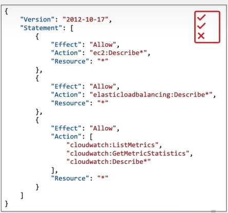
* You can delete user to remove all permissions and add a policy to add specific access 
* **Least Privilege principle**
  * Don't give more permissions than a user needs

***
#### IAM Policies
* IAM policies Inheritence
* Structure
  * Version  (Policy language version, "2012-10-17")
  * Id  (Identifier for policy - optional)
  * Statement
    * Sid (Identifiesr of statement - optional)
    * Effect (Allows/Denies access)
    * Principal (To whom Account/user/role)
    * Action (list of actions) 
    * Resource (Resources to which action is applied to - optional) 
* Policy summary and JSON : 2views
* Create custom policy using visual editor (service,actions, resources) or JSON editor

***

####IAM - Password Policy
* Change, expiration, prevent re-use, require specific chars, min. length to create strong passwords

####IAM - Multi Factor Authentication (MFA)
* MFA = password you know + security device you own
* **Virtual MFA** 
  * 
Google Authenticator {mobile}, Authy {multi-device}

  * Support for multiple tokens on a single device
* **Universal 2nd Factor (U2F) security Key**
  * Support for multiple roots and  IAM using a single security key
  *  YubiKey (3rd party)
* Hardware Key Fob MFA device by Gemalto (3rd party)
* Hardware Key Fob MFA device by AWS GovCloud (US) by SurePassId (3rd party) 
* 
***

###AWS CLI
* Open-source
* Alternative to AWS Management console
* AWS CLI is built on AWS SDK for Python
  
***

###AWS SDK
* Within application to access and manage AWS services programatically, set of libraries (language-spoecific APIs)
* Supports
  * SDKs (JavaScript, Python, PHP, .NET, Ruby, Java, Go, Node.js, C++)
  * Mobile SDKs (Android, iOS, …)
  * IoT Device SDKs (Embedded C, Arduino, …)

***
###IAM Roles for Services
* Common roles 
  * EC2 Instance Roles 
  * Lambda Function Roles 
  * Roles for CloudFormation 

***
### IAM Security tools
* IAM Credentials Report (account-level)
  * A report that lists all your account's users and the status of their various credentials
* IAM Access Advisor (user-level)
  * Access advisor shows the service permissions granted to a user and when those services were last accessed.
* You can use this information to revise your policies
***
###Summary
* Users: mapped to a physical user, has a password for AWS Console
* Groups: contains users only
* Policies: JSON document that outlines permissions for users or groups
* Roles: for EC2 instances or AWS services
* Security: MFA + Password Policy
* AWS CLI: manage your AWS services using the command-line
* AWS SDK: manage your AWS services using a programming language
* Access Keys: access AWS using the CLI or SDK
* Audit: IAM Credential Reports & IAM Access Advisor

***
##Amazon EC2
* EC2 = Elastic Compute Cloud = Infrastructure as a Service
  * Renting virtual machines (EC2)
  * Storing data on virtual drives (EBS)
  * Distributing load across machines (ELB)
  * Scaling the services using an auto-scaling group (ASG)
* Storage space: 
 * Network-attached (EBS & EFS) 
  * hardware (EC2 Instance Store)
* Bootstrap script (configure at first launch): EC2 User Data

***
### EC2 instance Types
* Optimised for different use-cases
  
* m5.2xlarge
  * m: instance class
  * 5: generation (AWS improves them over time)
  * 2xlarge: size within the instance class

|**General Purpose**   | Balance between compute memory and networking                                                                                                                                                                  |
|-----------------------|----------------------------------------------------------------------------------------------------------------------------------------------------------------------------------------------------------------|
|                       | 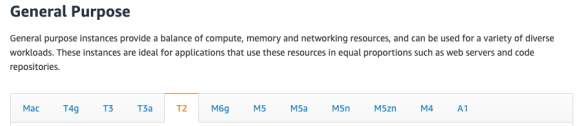                                                                                                                                                                                          |
| **Compute Optimized** | High performance processors  * Batch processing workloads  * Media Transcoding  * High Performance Computing  * High Performance Web Servers  * Scientific modeling and machine learning  * Dedicated gaming servers |
|                       | 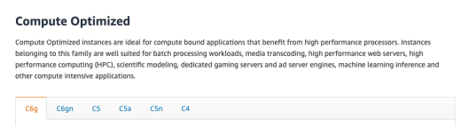                                                                                                                                                                                               |
| **Memory Optimized**  | Fast performance for workloads that process large data sets in memory  * High performance, relational/non-relational databases * Distributed web scale cache stores * In-memory databases optimized for BI (business intelligence) * Applications performing real-time processing of big unstructured data                                                                                                                                          |
|                       | 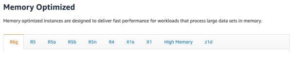                                                                                                                                                                                          |
| **Storage Optimized** | Great for storage-intensive tasks that require high, sequential read and write access to large data sets on local storage  * High frequency online transaction processing (OLTP) systems * Relational & NoSQL databases  * Cache for in-memory databases (for example, Redis)  * Data warehousing applications  * Distributed file systems |
|                       | 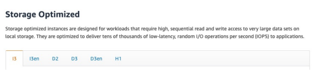                                                                                                                                                                                               |

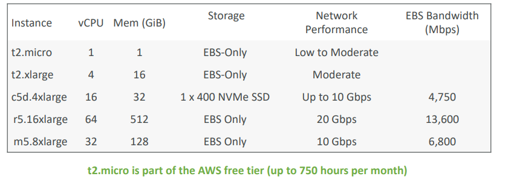

*** 
###

***
***
***
***
***

###AWS Right Sizing
* Scaling up is easy so always start small
* It’s important to Right Size…
  * before a Cloud Migration
  * continuously after the cloud onboarding process (requirements change over time)
* CloudWatch, Cost Explorer, Trusted Advisor, 3rd party tools to help
***

###AWS Right Sizing

***

###6 Pillars
1) Operational Excellence
2) Security
3) Reliability
4) Performance Efficiency
5) Cost Optimization
6) Sustainability

***

###Operational Excellence
* Ability to run and monitor systems to deliver business value
and improve supporting processes and procedures
* Design Principles
  * Perform operations as code
  * Annotate documentation
  * Make frequent, small, reversible changes
  * Refine operations procedures frequently 
  * Anticipate failure
  * Learn from all operational failures
  
* Operational Excellence AWS Services
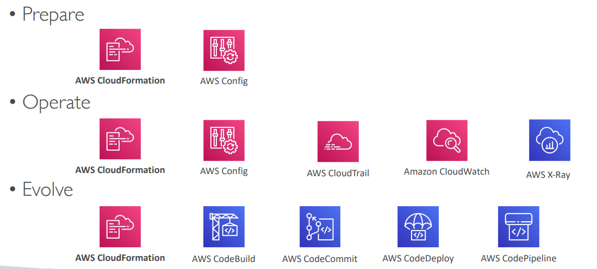

***

###Security

* Ability to protect information, systems, and assets while delivering risk assessments and mitigation strategies
* Design principles
  * **Implement a strong identity foundation**
    * Centralize privilege management and reduce (or even eliminate) reliance on long-term credentials - Principle of least privilege - IAM
  * **Enable traceability**  
    * Integrate logs and metrics with systems to automatically respond and take action
  * **Apply security at all layers** 
    * Like edge network, VPC, subnet, load balancer, every instance, operating system, and application
  * **Automate security best practices**
  * **Protect data in transit and at rest** 
    * Encryption, tokenization, and access control
  * **Keep people away from data**
    *  Reduce or eliminate the need for direct access or manual processing of data
  * **Prepare for security events**
    * Run incident response simulations and use tools with automation to increase your speed for detection, investigation, and recovery
  * **Shared Responsibility Model**

<!-- * Security AWS Services -->
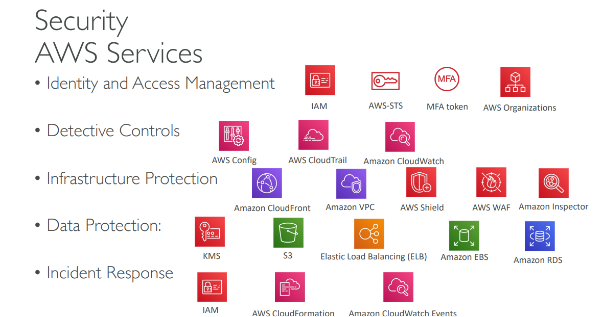

****

###Reliability
* Ability to recover from infrastructure or service disruptions,
dynamically acquire computing resources to meet demand, and mitigate
disruptions such as misconfigurations or transient network issues
* Design Principles
  * **Test recovery procedures**
    * Automation to simulate different failures or to recreatescenarios that led to failures before
  * **Automatically recover from failure**
    * Anticipate and remediate failures before they occur
  * **Scale horizontally to increase aggregate system availability**
    * Distribute requests across multiple, smaller resources to ensure that they don't share a common point of failure
  * **Stop guessing capacity**
    * Maintain the optimal level to satisfy demand without over or under provisioning - Use Auto Scaling
   * **Manage change in automation**
     * Use automation to make changes to infrastructure
<!-- * Reliability AWS services -->
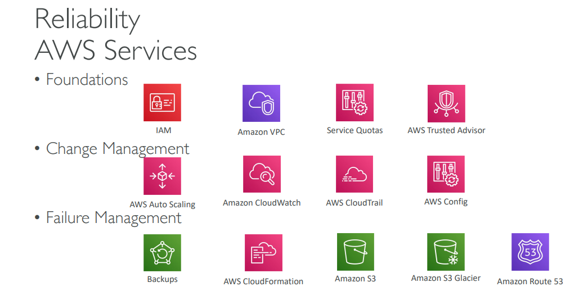

***

### Performance Efficiency
* Ability to use computing resources efficiently to meet
system requirements, and to maintain that efficiency as demand changes
and technologies evolve
* Design Principles
  * **Democratize advanced technologies**
    *  Advance technologies become services
and hence you can focus more on product development
  * **Go global in minutes**
    * Easy deployment in multiple regions
  * **Use serverless architectures** 
    * Avoid burden of managing servers
  * **Experiment more often** 
    * Easy to carry out comparative testing
  * **Mechanical sympathy**
    *  Be aware of all AWS services
<!-- * Performance Efficiency AWS services -->
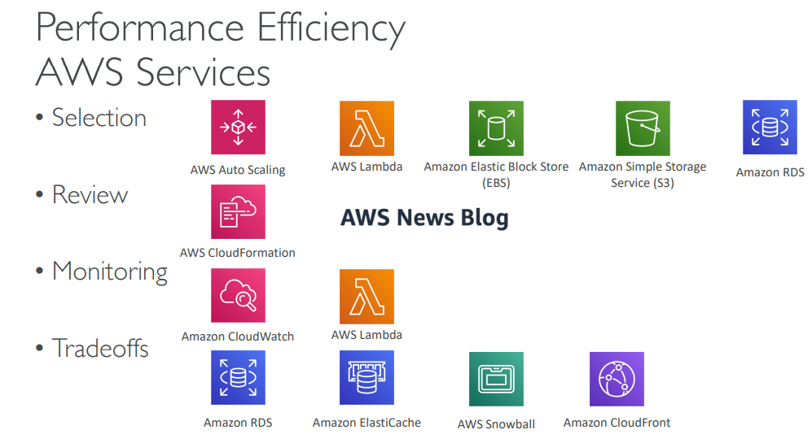

***

### Cost Optimization
* Ability to run systems to deliver business value at the lowest price point
* Design Principles 
  * **Adopt a consumption mode** 
    * Pay only for what you use
  * **Measure overall efficiency**
    * Use CloudWatch
  * **Stop spending money on data center operations**
    * AWS does the infrastructure part and enables customer to focus on organization projects
  * **Analyze and attribute expenditure**
    * Accurate identification of system usage and costs, helps measure return on investment (ROI) - Make sure to use tags
  * **Use managed and application level services to reduce cost of ownership** 
    * As managed services operate at cloud scale, they can offer a lower cost per transaction or service

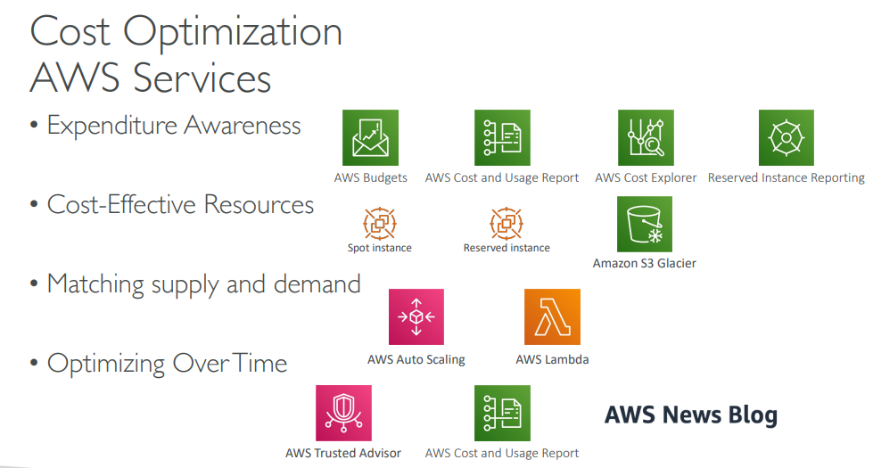
***

## Sustainability
* Minimizing environmental impact of running cloud workloads
* Design Principles
  * **Understand your impact**
    * Establish performance indicators, evaluate improvements
  * **Establish sustainability goals**
    * Set long-term goals for each workload, model return on investment (ROI)
  * **Maximize utilization**
    * Right size each workload to maximize the energy efficiency of the underlying hardware and minimize idle resources.
  * **Anticipate and adopt new, more efficient hardware and software offering**
    * Design for flexibility to adopt new technologies over time.
  * **Use managed services**
    * Shared services reduce the amount of infrastructure
    * Managed services help automate sustainability best practices as moving infrequent accessed data to cold storage and adjusting compute capacity.
  * **Reduce the downstream impact of your cloud workloads**
    * Reduce the amount of energy or resources required to use your services and reduce the need for your customers to upgrade their devices

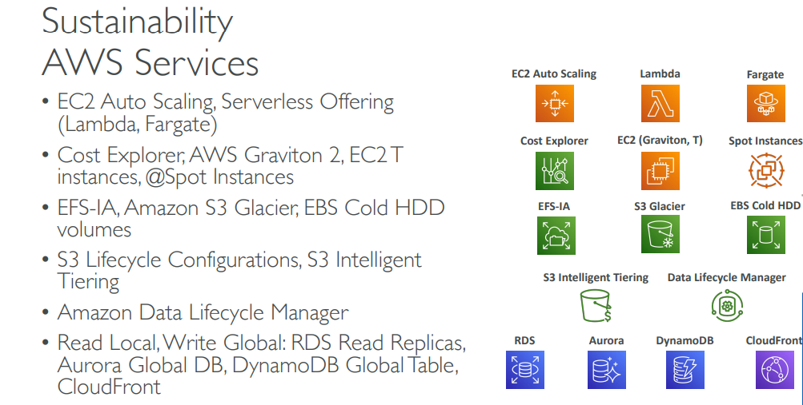

***
***
####SSH Summary

|           | SSH | PUTTY | EC2 Instance Connect |
|---        | --- | ---  |--- | 
|MAC        | ✅ | ---  |✅ |
|Linux      | ✅ | ---  |✅ |
|Windows<10 | --- | ✅  |✅ |
| Windows>10| ✅ | ✅  |✅ | 

***
***

####Ports
* 22 = SSH (Secure Shell) - log into a Linux instance
* 21 = FTP (File Transfer Protocol) – upload files into a file share
* 22 = SFTP (Secure File Transfer Protocol) – upload files using SSH
* 80 = HTTP – access unsecured websites
* 443 = HTTPS – access secured websites
* 3389 = RDP (Remote Desktop Protocol) – log into a Windows instance

****

|SNS|Step function|SWF|SQS|MQ|
|---|---| ---  | ---|---|

***

###AWS Ecosystem - AWS Support

<table>
<tr><td><Strong>Developer</Strong></td>
<td>
<ul>
<li>Business hours email access to Cloud Support Associates</li>
<li>
General guidance: < 24 business hours</li>
<li>System impaired: < 12 business hours </li></ul>
</td>
</tr>
<tr>
<td>
<Strong>Business</Strong></td>
<td><ul>
<li>
24x7 phone, email, and chat access to Cloud Support Engineers</li>
<li>
Production system impaired: < 4 hours</li>
<li>
Production system down: < 1 hour</li></ul></td>
</tr>
<tr>
<td>
<strong>Enterprise</strong></td>
<td><ul><li>Access to a Technical Account Manager (TAM) </li>
<li>
Concierge Support Team (for billing and account best practices</li>
<li>Business-critical system down: < 15 minutes
</li></ul></td></tr>

</table>

***
### S3 bucket naming convention
  * No uppercase
  * No underscore
  * 3-63 characters long
  * Not an IP
  * Must start with lowercase letter or number

***
##Global infrastructure
* Either by using regions or edge locations
* Advantages: Decreased latency, attack protection, Disasater recovery
* 